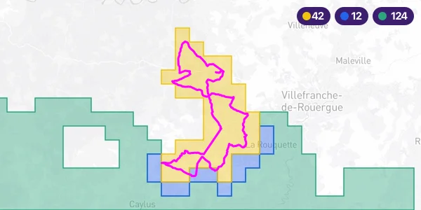

# Activity cards

An activity card is a single image showing one activity: the ground you had
already covered around it, the tiles it was the first to cover, the tiles it
closed in, and the track itself.



It is drawn at build time and written out as a file, which is what makes it
different from a static map service: the shapes never travel through a URL, so
their number, their size and their holes are all free, and the counts can be
drawn onto the image.

> Cards need [`sharp`](https://sharp.pixelplumbing.com), which the plugin
> declares as an **optional** peer dependency -- a site using only the tile data
> never installs it. `yarn add sharp` if you want cards.

## Drawing one

```js
// gatsby-node.js
const {
    getActivityCards,
    renderActivityCard,
} = require("gatsby-strava-tiles/card")
```

It takes two steps, and the split is the point: the cheap one runs over your
whole history, the expensive one runs only over the activities you actually
show.

### 1. `getActivityCards({activities, groups})`

Walks the history once and returns, for each group named in `groups`, what it
takes to draw it. `activities` is every activity that has tiles, each as
`{id, start_date, tiles}` -- no coordinates, so this query stays cheap even
with thousands of them.

A group is its own array of ids -- one activity most of the time, several for
a multi-day trip you want drawn as a single card rather than one per day:

```js
const history = await graphql(`
    {
        allStravaActivity(filter: {coordinates: {ne: null}}) {
            nodes {
                id
                start_date
                tiles {
                    x
                    y
                }
            }
        }
    }
`)

// One activity per card...
const cards = getActivityCards({
    activities: history.data.allStravaActivity.nodes,
    groups: [["12345"], ["12346"]],
})

// ...or several merged into one, for a trip spanning a few days
const [trip] = getActivityCards({
    activities: history.data.allStravaActivity.nodes,
    groups: [["12345", "12346", "12347"]],
})
```

Each result is `{ids, added, clustered, coverage}`, `ids` being the group's own
ids back:

| Field       | What it is                                                                                |
| ----------- | ----------------------------------------------------------------------------------------- |
| `added`     | Tiles the group was the first to cover                                                    |
| `clustered` | Tiles whose four neighbours all became covered across the group's span -- holes it closed |
| `coverage`  | Every tile covered once the group is done                                                 |

Walking the whole history is what makes `added` and `clustered` mean anything:
they describe the coverage **as of the group**, not today's. The list is sorted
by `start_date` internally, so the order activities arrive in -- or the order
ids appear within a group -- does not matter.

A group is treated as if it had been recorded as one activity spanning from its
first member's start to its last: `added` is the union of what its members were
each first to cover (already mutually exclusive -- a tile only ever belongs to
the first activity, in the whole history, to reach it), while `coverage` and
`clustered` bracket the group's full time span, so ground covered by anything
else in between still counts.

### 2. `renderActivityCard(options)`

Draws one card and returns `{image, zoom, backgroundTiles}`, where `image` is a
buffer for you to write wherever your site serves files from.

```js
const {image} = await renderActivityCard({
    ...card,
    coordinates: activity.coordinates,
    tileUrl: ({z, x, y}) =>
        `https://api.mapbox.com/styles/v1/mapbox/light-v11/tiles/256/${z}/${x}/${y}@2x` +
        `?access_token=${process.env.MAPBOX_TOKEN}`,
    cacheDir: "./.cache/card-background-tiles",
})
```

For a card built from `getActivityCards`'s `groups`, pass the matching
activities' `coordinates` as an array of tracks instead of one -- each is
drawn as its own line, so a trip spanning several days never draws a straight
line from where one day ends to where the next begins:

```js
coordinates: [day1.coordinates, day2.coordinates, day3.coordinates]
```

| Option          | Default            | What it does                                                                       |
| --------------- | ------------------ | ---------------------------------------------------------------------------------- |
| `coordinates`   | required           | One track, or several for a card merging more than one activity                    |
| `added`         | `[]`               | Tiles drawn as new                                                                 |
| `clustered`     | `[]`               | Tiles drawn as closed in                                                           |
| `coverage`      | `[]`               | Tiles drawn as already covered                                                     |
| `activityTiles` | from `coordinates` | What the card is framed on                                                         |
| `size`          | `600 x 300`        | Output size in pixels                                                              |
| `padding`       | `2`                | Tiles of context kept around the activity                                          |
| `minSize`       | `8`                | Smallest frame, in tiles, so a short outing does not fill the card with one colour |
| `tileUrl`       | none               | Where to fetch the background. **Leave it out for no background at all**           |
| `cacheDir`      | none               | Where to keep fetched background tiles between builds                              |
| `outlined`      | `true`             | One continuous shape per area, holes included, instead of one square per tile      |
| `style`         | see below          | Colours and weights, merged over the defaults                                      |
| `format`        | WebP, quality 85   | Passed to sharp. A map background is photographic: WebP is ~7x smaller than PNG    |

The three tile sets overlap -- a tile can be both new and newly closed in -- so
each is drawn only where the one above it is not, and each badge counts the
tiles its own colour paints. The three therefore add up to what is on the card.

### The background

`tileUrl` is called with `{z, x, y}` and must return a raster tile URL. Any
provider works; the plugin never assumes one.

Two things worth knowing:

-   **The zoom is chosen for you**, and it is not 14. The overlay is drawn from
    geometry, so the background only has to match the card's own resolution. A
    card showing 15 km of ground needs zoom 12, where the same frame costs 6 tiles
    instead of the 40 zoom 14 would spend to be thrown away in the resize.
-   **Pick a neutral style.** Coverage is drawn as a translucent fill; on a green,
    shaded basemap it disappears. A flat style also compresses better.

Leaving `tileUrl` out draws the tiles on a flat colour instead: no request, no
token, no provider -- and no place names either, which is usually too high a
price for a card in a blog post.

### Outline or tiles

```js
outlined: false // one square per tile, borders included, instead of one shape
```

A card never goes through a URL -- it is composited straight into an image
buffer -- so neither shape count nor complexity costs anything here, unlike
the plugin's own `outlines` field. `outlined` is purely a look: the default
draws one continuous shape per area, holes included; `false` draws every tile
as its own square instead, which reads as a grid rather than a shape once an
area gets large.

### Style

```js
style: {
  covered: "#2ca57e",
  clustered: "#2563eb",
  added: "#f1c40f",
  track: "#ff00ff",
  background: "#e9e6e1", // only used when no `tileUrl` is given
  fillOpacity: 0.4,      // the three coverage areas
  strokeOpacity: 1,
  strokeWidth: 1.5,
  trackWidth: 3,
  badge: "#3b1d6e",      // the count badges
  badgeText: "#ffffff",
}
```

## Only drawing what you show

Nothing draws a card unless you ask for it by id. Rendering a whole history
would mean thousands of images built and deployed for the handful a page ever
shows, so `groups` is what drives the work -- and an activity outside all of
them costs neither an image nor a single background tile.

A card also never changes once drawn: it shows its own track and the coverage
that existed before it, and no later activity can alter either. Skipping the
ones already on disk is safe.

The [`example`](../example) app does all of this in about a hundred lines:
[`gatsby-node.js`](../example/gatsby-node.js) draws the twenty most recent
activities and [`cards.js`](../example/src/templates/cards.js) lists them.
